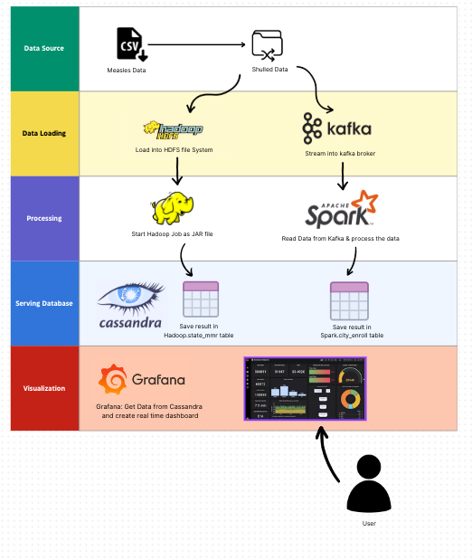

# Big Data Project: MRR Vaccination Data Analysis
## Overview
This project aims to analyze MRR (Measles, Rubella, and Rubella) vaccination data from various US states. We’ll use both streaming and batch processing techniques. The data will be stored in Hadoop, processed using Spark, and saved in Cassandra tables. Grafana will visualize the results.

**Project Structure:**
```
.
├── cassandra-setup.cql
├── config.sh
├── Data
│   ├── all-measles-rates.csv
│   └── shuffle.py
├── docker-compose.yml
├── grafana
│   ├── dashboards
│   ├── grafana.ini
│   └── provisioning
├── scripts
│  ├── cassandra-tables.sh
│  ├── grafana-config.sh
│  ├── hadoop-job.sh
│  ├── kafka-producer.sh
│  └── spark-job.sh
├── README.md
```

## Workflow


1. Docker Compose Setup: docker-compose up -d --build
2. Copy JAR files into the Hadoop master container:
   docker cp <path-to-jars> hadoop-master:/<destination-path>
   ( You can use the build.sh script to automate this step from the Vaccination-Rate-Hadoop and Vaccination-Rate-Spark repositories)
3. MRR vaccination Data Shuffling
4. Copy the shuffled data into the Hadoop master.

5. #### Streaming Job
   * Create a Kafka topic for streaming.
   * Stream the data into Kafka.
   * Process the data using a Spark job.
   * Save the processed results in a Cassandra table.

6. #### Batch Job
   * Load the data into HDFS (Hadoop Distributed File System).
   * Run a Hadoop job to process the batch data.
   * Save the results in another Cassandra table.

7. #### Visualization
   * Grafana retrieves data from both Cassandra tables using a plugin.
   * Grafana creates real-time dashboards to visualize insights from the streaming and batch jobs.

Run config.sh to configure and start the jobs.